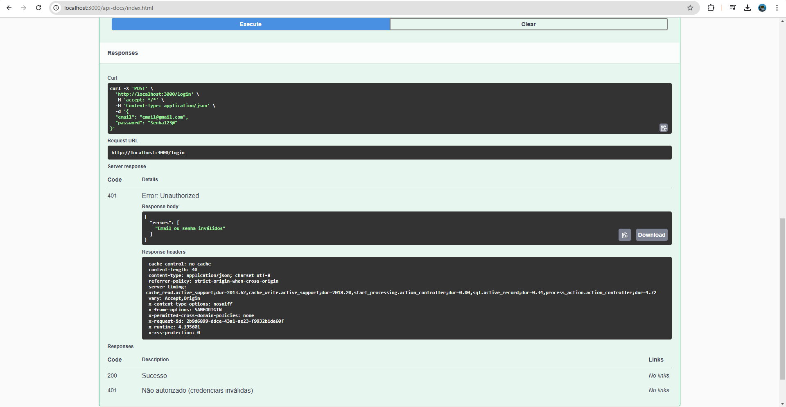

# Blog - Aplicação Full Stack com Ruby on Rails e Vue.js

## Tecnologias e GEMS Utilizadas
### Backend
- **Ruby on Rails**: Framework para a construção da API.
- **PostgreSQL**: Banco de dados relacional.
- **JWT**: Autenticação e autorização.
- **Sidekiq**: Processamento em background.
- **Rack::Attack**: Proteção contra abusos de requisições.
- **rack-cors**: Configuração de CORS para permitir requisições de domínios externos.
- **vite_rails**: Integração com o Vite.js para um ambiente de desenvolvimento rápido.
- **bcrypt**: Hashing de senhas para segurança.
- **kaminari**: Paginação de dados para listas grandes.
- **sendgrid-ruby**: Envio de emails usando a API SendGrid.
- **pg**: Driver para PostgreSQL.
- **redis**: Armazenamento em memória para caching e filas de processamento.

### Frontend
- **Vue.js**: Framework para interface do usuário.
- **Axios**: Gerenciamento de requisições HTTP.
- **Vue Router**: Controle de rotas e navegação no frontend.

## Funcionalidades
### Usuários
- Cadastro, login e logout.
- Recuperação e redefinição de senha.
- Atualização de perfil com validação de senha.

### Posts
- Listagem de posts (com paginação e busca por título, conteúdo ou tags).
- Criação, edição e exclusão de posts.
- Upload em massa de posts via arquivo.

### Comentários
- Criação, edição e exclusão de comentários.
- Administração de comentários (ocultar/revelar).
- Sistema de votação: os usuários podem dar "upvotes" ou "downvotes" para marcar comentários como úteis ou não.

### Tags
- Gerenciamento de tags associadas aos posts.
- Upload em massa de tags via arquivo.

### Admin
- Exclusão de usuários.
- Visualização de todos os posts e comentários (inclusive ocultos).

## Pré-requisitos
- **Ruby**: Versão 3.0 ou superior.
- **Rails**: Versão 8.0 ou superior.
- **Node.js** e **npm** (ou **yarn**).
- **PostgreSQL**: Para o banco de dados.

## Instalação e Configuração
### Backend
1. Clone o repositório:
   ```bash
   git clone <url-do-repositorio>
   cd <nome-do-repositorio>
   ```
2. Instale as dependências:
   ```bash
   bundle install
   ```
3. Configure o banco de dados:
   - Renomeie o arquivo `config/database.yml.example` para `config/database.yml`.
   - Atualize as credenciais do banco de dados conforme necessário.
   ```bash
   rails db:create db:migrate
   ```
4. Configure as credenciais:
   ```bash
   rails credentials:edit
   ```
   Adicione a chave de API do SendGrid, URL do frontend, etc.
5. Configure o arquivo `.env`:
   - Ambiente de desenvolvimento:
     ```env
     CORS_ORIGINS=http://localhost:8080
     ```
6. Inicie o servidor:
   ```bash
   rails server
   ```

### Frontend
1. Acesse o diretório `frontend`:
   ```bash
   cd frontend
   ```
2. Instale as dependências:
   ```bash
   yarn install
   ```
3. Configure o arquivo `.env`:
   - Ambiente de desenvolvimento:
     ```env
     VUE_APP_API_BASE_URL=http://localhost:3000
     ```
4. Inicie o servidor:
   ```bash
   yarn serve
   ```

## Testes
### Backend
1. Execute os testes RSpec:
   ```bash
   rspec
   ```
2. Gere a documentação Swagger:
   ```bash
   rake rswag:specs:swaggerize
   ```

## Documentação da API
Acesse a documentação Swagger em:
- **URL do Backend**: `/api-docs`

## Deploy
### Backend
1. Configure as variáveis de ambiente para o ambiente de produção:
   - **SENDGRID_API_KEY**
   - **DB_NAME**, **DB_USERNAME**, **DB_PASSWORD**, etc.
2. Execute as migrações:
   ```bash
   rails db:migrate
   ```
3. Inicie o servidor em produção.

### Frontend
1. Gere a versão de produção:
   ```bash
   yarn build
   ```
2. Configure o diretório `dist` no servidor de hospedagem.

## Arquitetura e Organização
- **Backend**:
  - Controllers: Gerenciam as requisições e respostas.
  - Models: Gerenciam a lógica de negócio e interações com o banco de dados.
  - Config: Configuração do ambiente e rotas.
  - Workers: Tarefas em segundo plano (uploads em massa).

- **Frontend**:
  - Componentes: Divisão modular da interface.
  - Rotas: Configuração de navegação entre páginas.
  - Serviços: Comunicação com a API (Axios).

  ## Modelagem do Banco de Dados

Abaixo está o diagrama do banco de dados utilizado no projeto:


## Testes Realizados

Durante o desenvolvimento do backend, realizei alguns testes para garantir a estabilidade e funcionalidade da aplicação. Abaixo estão exemplos de testes executados:

### Execução dos Testes Automatizados


### Exemplo de Testes



## Contato

- Email: [caioinacio19@gmail.com](mailto:caioinacio19@gmail.com)

